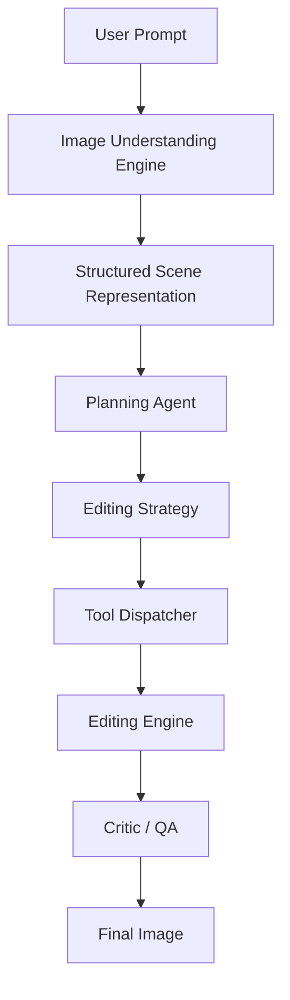

# Adobe Mock PS Backend

AI-assisted image editing with deep image understanding, structured planning, tool reasoning, and quality critique. Upload an image, describe the edit, and the backend orchestrates: **Image Understanding → Planning Agent → Tool Dispatcher → Execution → Critic**.



```bash
# One-shot example
curl -X POST http://localhost:8000/upload -F "file=@photo.jpg"
# → {"filename":"upload_abc123.png",...}

curl -X POST http://localhost:8000/edit \
  -H "Content-Type: application/json" \
  -d '{"prompt":"remove the person and make it cyberpunk","image":"upload_abc123.png"}'
# → {"job_id":"...","status":"completed","steps":[...],"final_image":"<base64>"}
```

---

## Quick Start

```bash
# 1. Environment
cd backend
python3 -m venv venv && source venv/bin/activate

# 2. Dependencies (CPU-only)
pip install -r requirements.txt

# 3. Dependencies (GPU) — install AFTER requirements.txt
pip install torch torchvision --index-url https://download.pytorch.org/whl/cu124

# 4. Configure
cp .env.example .env
# Edit .env → set GEMINI_API_KEY="your-key"

# 5. Run
uvicorn app.main:app --reload --host 0.0.0.0 --port 8000
```

Open `http://localhost:8000/docs` for the interactive Swagger UI.

---

## Prerequisites

| Requirement | Notes |
|---|---|
| **Python 3.11+** | `python3 --version` |
| **pip** | `python3 -m pip --version` |
| **Gemini API key** | Get one free at [aistudio.google.com](https://aistudio.google.com/apikey) |
| **NVIDIA GPU** (optional) | For faster model inference; CPU works but is slower |
| **CUDA 12.4+** (if GPU) | `nvidia-smi` to check driver version |

### GPU Setup (RTX 2050 / 4 GB VRAM tested)

The 4 GB VRAM on the RTX 2050 is tight but sufficient with these settings:

- **All models run on CUDA when available** — SAM, diffusion, and ESRGAN all auto-detect and use GPU
- **SAM** uses **float16** on CUDA for reduced VRAM; falls back to CPU if CUDA unavailable
- **InstructPix2Pix** / **Stable Diffusion Inpainting** loads in **float16** on GPU
- Models are **unloaded** between pipeline steps (only one model in GPU at a time)
- **SAM mask is passed to the diffusion pipeline** for guided inpainting — the mask from the `segment` step is consumed by the subsequent `remove` or `replace_background` step to constrain regeneration to the relevant area instead of a blind full-image img2img pass

```bash
# Install CUDA 12.4 PyTorch (compatible with driver 550.xx)
pip install torch==2.6.0 torchvision==0.21.0 \
  --index-url https://download.pytorch.org/whl/cu124
```

Verify:
```bash
python -c "import torch; print('CUDA:', torch.cuda.is_available())"
# → CUDA: True
```

---

## Full API Reference

### `GET /health`

Server status and capability check.

```bash
curl http://localhost:8000/health
```

```json
{
  "status": "ok",
  "version": "1.0.0",
  "cuda_available": true,
  "device": "cuda",
  "gemini_configured": true,
  "uptime_seconds": 42.5
}
```

---

### `POST /upload`

Upload an image file (multipart/form-data). Supported formats: JPEG, PNG, WebP, BMP. Max size: 10 MB (configurable).

```bash
curl -X POST http://localhost:8000/upload \
  -F "file=@photo.jpg"
```

```json
{
  "filename": "upload_a1b2c3d4e5f6.png",
  "original_name": "photo.jpg",
  "size_bytes": 284720,
  "width": 1920,
  "height": 1080,
  "content_type": "image/jpeg"
}
```

Save the `filename` — you'll use it in the `/edit` request.

---

### `POST /edit`

Execute an editing prompt on a previously uploaded image.

```bash
curl -X POST http://localhost:8000/edit \
  -H "Content-Type: application/json" \
  -d '{
    "prompt": "remove the person on the left and make the scene cyberpunk at night with neon lights",
    "image": "upload_a1b2c3d4e5f6.png"
  }'
```

**How it works:**

1. **Image Understanding** — The Vision Engine analyzes the image (scene type, colors, brightness, contrast, faces, sharpness, lighting, noise)
2. **Planning** — The Planning Agent receives the user prompt + image metadata + tool registry (33 editing tools with strengths/weaknesses) and generates a structured execution plan
3. **Dispatch** — The Tool Dispatcher maps each plan step to a registered tool or legacy handler
4. **Execution** — Each step runs sequentially, passing context (masks, intermediate images) between steps
5. **Critique** — The Critic/QA module evaluates the result for artifacts, halos, color clipping, over-sharpening, noise, color shift, and brightness shifts
6. **Response** — Returns the final image + step images + explanation + metadata + plan + critique

**Response:**

```json
{
  "job_id": "f6e5d4c3b2a1",
  "status": "completed",
  "steps": [
    {
      "operation": "segment",
      "image": "iVBORw0KGgoAAAANSUhEUgAAAA...",
      "mask": "iVBORw0KGgoAAAANSUhEUgAAAA...",
      "duration_ms": 9405.12,
      "details": { "mask_path": "temp/mask_abc.png" }
    },
    {
      "operation": "remove",
      "image": "iVBORw0KGgoAAAANSUhEUgAAAA...",
      "mask": "iVBORw0KGgoAAAANSUhEUgAAAA...",
      "duration_ms": 14423.87,
      "details": null
    },
    {
      "operation": "change_style",
      "image": "iVBORw0KGgoAAAANSUhEUgAAAA...",
      "mask": "iVBORw0KGgoAAAANSUhEUgAAAA...",
      "duration_ms": 13586.45,
      "details": null
    }
  ],
  "final_image": "iVBORw0KGgoAAAANSUhEUgAAAA...",
  "total_duration_ms": 37685.44,
  "execution_log": [
    {
      "operation": "segment",
      "target": "person",
      "model": "sam-vit-base",
      "parameters": { "target": "person" },
      "status": "success",
      "reason": "",
      "duration": 9405.12
    },
    {
      "operation": "remove",
      "target": "",
      "model": "sd-inpaint",
      "parameters": {},
      "status": "success",
      "reason": "",
      "duration": 14423.87
    }
  ],
  "explanation": {
    "plain_english": "The person was identified and removed from the image. The background was preserved. The overall colors were then adjusted to a cyberpunk style with neon tones.",
    "technical_summary": "- Person segmented using SAM.\n- Object removed via inpainting.\n- Style transferred via InstructPix2Pix.",
    "changes": [
      {
        "operation": "segment",
        "target": "person",
        "description": "The person was identified and separated.",
        "technical": "Segmented using SAM (ViT-B)."
      },
      {
        "operation": "remove",
        "target": "",
        "description": "The person was removed from the image.",
        "technical": "Object removed via inpainting."
      }
    ]
  },
  "error": null,

  "metadata": {
    "scene_type": "landscape",
    "dominant_colors": [{"hex":"#2a4b7c","rgb":[42,75,124],"percentage":0.35,"name":"blue"}],
    "brightness": 118.5,
    "contrast": 45.2,
    "has_faces": false,
    "lighting": "normal",
    "aesthetic_score": 6.2
  },

  "plan": {
    "reasoning": "Image is a landscape with blue sky. User wants cyberpunk. Step 1: segment sky. Step 2: replace background with neon city. Step 3: apply color grading.",
    "steps": [
      {"operation": "segment sky", "tool": "segment", "params": {"target":"sky"}, "reasoning":"Isolate the sky for replacement", "priority": 1},
      {"operation": "replace background", "tool": "background_replacement", "params": {"prompt":"cyberpunk city neon night"}, "reasoning":"Generate cyberpunk background", "priority": 2, "requires_mask": true, "mask_source": "segment sky"},
      {"operation": "color grade", "tool": "color_grading", "params": {"shadows":{"r":-10,"g":0,"b":20},"highlights":{"r":30,"g":0,"b":-10}}, "reasoning":"Add purple-blue cyberpunk color cast", "priority": 3}
    ],
    "estimated_cost": "high"
  },

  "critique": {
    "passed": false,
    "score": 0.75,
    "issues": [
      {"type": "color_cast", "severity": 0.35, "description": "Minor hue shift detected", "suggestion": "Consider white balance correction"}
    ],
    "suggestions": ["Consider white balance correction"]
  }
}
```

**Per-step masks for non-destructive toggling:**

Each step now includes a `mask` field (base64 PNG) showing exactly which pixels were changed by that operation. The frontend can use these masks to:

- **Toggle operations on/off** — Compositing only visible steps' masked regions
- **Show per-operation visual diff** — Highlight exactly what changed
- **Non-destructive layering** — Each edit stays as a toggleable layer

Example mask compositing logic (JavaScript):
```javascript
async function compositeSteps(originalUrl, steps, visibility) {
  const canvas = document.createElement('canvas');
  const ctx = canvas.getContext('2d');
  const base = await loadImage(originalUrl);
  canvas.width = base.naturalWidth;
  canvas.height = base.naturalHeight;
  ctx.drawImage(base, 0, 0);
  for (let i = 0; i < steps.length; i++) {
    if (visibility[i] === false) continue;
    const stepImg = await loadImage(`data:image/png;base64,${steps[i].image}`);
    if (steps[i].mask) {
      const maskImg = await loadImage(`data:image/png;base64,${steps[i].mask}`);
      const temp = document.createElement('canvas');
      temp.width = canvas.width;
      temp.height = canvas.height;
      const tCtx = temp.getContext('2d');
      tCtx.drawImage(stepImg, 0, 0, canvas.width, canvas.height);
      tCtx.globalCompositeOperation = 'destination-in';
      tCtx.drawImage(maskImg, 0, 0, canvas.width, canvas.height);
      ctx.drawImage(temp, 0, 0);
    } else {
      ctx.drawImage(stepImg, 0, 0, canvas.width, canvas.height);
    }
  }
  return canvas.toDataURL('image/png');
}
```

**Decoding base64 images (JavaScript):**

```javascript
const response = await fetch('http://localhost:8000/edit', { /* ... */ });
const data = await response.json();

// Each image is a base64-encoded PNG
data.steps.forEach(step => {
  const img = document.createElement('img');
  img.src = `data:image/png;base64,${step.image}`;
  document.body.appendChild(img);
});

// Or final image
const finalImg = document.querySelector('#result');
finalImg.src = `data:image/png;base64,${data.final_image}`;
```

**Decoding base64 images (Python):**

```python
import base64
from PIL import Image
import io

# Save a step image to disk
img_data = base64.b64decode(response["steps"][0]["image"])
img = Image.open(io.BytesIO(img_data))
img.save("step_0_segment.png")
```

**If the request takes too long**, the HTTP connection may time out. You can:

- Increase the timeout: `curl --max-time 300 ...`
- Or use the async polling approach below

---

### `GET /result/{job_id}`

Retrieve a completed or failed job result. Use this for long-running edits.

```bash
JOB_ID=$(curl -s -X POST http://localhost:8000/edit \
  -H "Content-Type: application/json" \
  -d '{"prompt":"make it cyberpunk","image":"upload_abc.png"}' \
  | python3 -c "import sys,json;print(json.load(sys.stdin)['job_id'])")

# Poll until complete
sleep 20
curl http://localhost:8000/result/$JOB_ID
```

Same response schema as `POST /edit`.

---

### `GET /history/{job_id}`

Job metadata (status, prompt, input image, progress).

```bash
curl http://localhost:8000/history/$JOB_ID
```

```json
{
  "job_id": "f6e5d4c3b2a1",
  "status": "completed",
  "created_at": "2026-07-07T18:25:50+00:00",
  "progress": {
    "prompt": "remove the person and make it cyberpunk",
    "input_image": "upload_a1b2c3d4e5f6.png",
    "steps_count": 3,
    "error": null
  }
}
```

---

### `POST /analyze`

Analyze an image and return structured scene metadata. No editing — pure understanding.

```bash
curl -X POST http://localhost:8000/analyze \
  -H "Content-Type: application/json" \
  -d '{"image": "upload_a1b2c3d4e5f6.png"}'
```

```json
{
  "metadata": {
    "scene_type": "portrait",
    "faces": [{"x": 120, "y": 80, "width": 60, "height": 75}],
    "people_count": 1,
    "dominant_colors": [
      {"hex": "#d4a574", "rgb": [212, 165, 116], "percentage": 0.32, "name": "orange"}
    ],
    "brightness": 142.0,
    "contrast": 38.5,
    "sharpness": 320.0,
    "is_blurry": false,
    "has_faces": true,
    "lighting": "bright",
    "aesthetic_score": 7.1
  },
  "suggestions": [
    "Faces detected. Try portrait enhancement or skin smoothing."
  ],
  "processing_time_ms": 45.2
}
```

Also accepts data URLs: `{"image": "data:image/png;base64,..."}`.

---

## Editing Prompt Guide

The Gemini planner maps natural language to structured operations. Here's how prompts are interpreted:

| Prompt | Generated Plan |
|---|---|
| "remove the person" | `[{"operation":"segment","target":"person"}, {"operation":"remove"}]` |
| "make it cyberpunk" | `[{"operation":"change_style","instruction":"make the scene cyberpunk"}]` |
| "change the background to a beach" | `[{"operation":"replace_background","instruction":"change the background to a beach"}]` |
| "upscale the image" | `[{"operation":"upscale"}]` |
| "remove the car and make it rainy night" | `[{"operation":"segment","target":"car"}, {"operation":"remove"}, {"operation":"change_style","instruction":"make it rainy night"}]` |

**Tips for good results:**

- Be specific about what to segment / remove / change
- Combine operations naturally (Gemini splits them automatically)
- For style changes, describe the target style clearly
- Image size affects inference time; 512×512 is optimal

---

## Supported Operations

### AI / Model Operations

| Operation | Model | Description |
|---|---|---|
| `segment` | SAM (ViT-Base) | Segments an object by target name; generates a mask |
| `remove` | InstructPix2Pix / SD Inpainting | Removes the main subject via masked inpainting |
| `replace_background` | InstructPix2Pix / SD Inpainting | Replaces background by inverting SAM mask |
| `remove_background` | rembg | Makes background transparent (human-optimized with `u2net_human_seg`) |
| `change_style` / `style_transfer` | InstructPix2Pix | Applies artistic style transformation |
| `upscale` | ESRGAN / PIL Bicubic | AI super-resolution upscaling |
| `inpainting` | SD Inpainting | Fill masked region with AI-generated content |
| `generative_fill` | SD Inpainting | Context-aware content fill |
| `background_replacement` | SD Inpainting | Replace background with AI-generated scene |
| `face_enhancement` | OpenCV / AI | Enhance facial features |
| `object_removal` | SD Inpainting | Remove objects via mask-guided inpainting |

### Traditional / CV Operations (no GPU needed)

| Category | Tools |
|---|---|
| **Adjustments** | brightness, contrast, saturation, hue, exposure, temperature, tint, levels, curves, shadow_recovery, highlight_recovery |
| **Filters** | sharpen, blur, gaussian_blur, denoise |
| **Transforms** | crop, rotate, resize |
| **Color** | color_grading, black_and_white, film_lut |
| **Effects** | vignette |
| **Portrait** | skin_smoothing |
| **Restoration** | healing |

The **Tool Registry** (`app/tools/registry.py`) maintains specs for all 33 tools with purpose, strengths/weaknesses, best/avoid cases, parameters, GPU cost, and latency.

---

## Post-Edit Explanation System

Every completed edit returns an `execution_log` and `explanation` alongside the edited image. This ensures users always know exactly what the AI did and why.

### Execution Log

The `ExecutionLog` records every pipeline step with these fields:

| Field | Type | Description |
|---|---|---|
| `operation` | string | Operation name (`segment`, `remove`, `replace_background`, etc.) |
| `target` | string | Target object (e.g. `"person"`, `"background"`) |
| `model` | string | AI model used (`sam-vit-base`, `sd-inpaint`, `instruct-pix2pix`, etc.) |
| `parameters` | object | Parameters passed to the operation |
| `status` | string | `"success"`, `"skipped"`, or `"failed"` |
| `reason` | string | Why an operation was skipped or failed |
| `duration` | float | Execution time in milliseconds |

Log entries are appended by the pipeline executor at each step. This is the **single source of truth** — explanations are always derived from the log, never from the original prompt.

### Explanation Service

Located at `app/services/explanation/`. Architecture:

```
ExplanationService
├── generate(prompt, execution_log, metadata) → ExplanationResult
│
├── [provider] ExplanationProvider (ABC)
│   ├── GeminiExplanationProvider    # LLM-backed (default when GEMINI_API_KEY is set)
│   └── LocalExplanationProvider     # Deterministic fallback (no LLM needed)
│
└── prompts.py                       # All LLM prompt templates (isolated)
```

**ExplanationResult** contains:

| Field | Description |
|---|---|
| `plain_english` | 2-3 sentence plain-English explanation of what actually happened |
| `technical_summary` | Bullet-point summary for advanced users |
| `changes[]` | Per-operation descriptions with `operation`, `target`, `description`, `technical` |

### Provider Selection

The `get_explanation_service()` dependency in `dependencies.py` selects the provider:

1. If `GEMINI_API_KEY` is configured → uses `GeminiExplanationProvider`
2. Otherwise → uses `LocalExplanationProvider` (deterministic, always works)

A local LLM can be swapped in later by implementing the `ExplanationProvider` ABC.

### Design Rules

- **Log is truth** — The explanation generator receives the execution log and must describe only what the log contains
- **No inference** — Never infer operations that don't exist in the log
- **Status-aware** — Successful operations are described; skipped/failed operations are mentioned accurately (never falsely described as successful)
- **Deterministic fallback** — Without an LLM, the local provider produces accurate explanations directly from the log
- **UI-friendly** — The `plain_english` field is designed to be shown directly to end users

### Example

Input execution log:

```
segment → person → success
replace_background → beach → success
upscale → skipped (image already high resolution)
```

Local provider produces:
> "The person was separated from the original background and placed onto a beach scene. Image upscaling was not performed."

Technical summary:
> ```
> - Person segmented using SAM.
> - Background replaced via inpainting.
> - upscale skipped.
> ```

### Unit Tests

```bash
cd backend
source venv/bin/activate
python -m pytest tests/ -v
```

Tests verify:
- Skipped operations are never described as successful
- Failed operations are never described as successful
- Changes list accurately reflects the execution log
- Empty/all-skipped/all-failed logs produce correct output

---

## Configuration

All settings via `.env` file:

| Variable | Default | Description |
|---|---|---|
| `GEMINI_API_KEY` | `""` | Google Gemini API key |
| `GEMINI_MODEL` | `gemini-3.1-flash-lite` | Gemini model name |
| `DEVICE` | `auto` | Override: `cuda`, `cpu`, `mps` |
| `OUTPUT_DIRECTORY` | `outputs` | Edited images directory |
| `UPLOAD_DIRECTORY` | `uploads` | Uploaded images directory |
| `TEMP_DIRECTORY` | `temp` | Temporary files directory |
| `MAX_UPLOAD_SIZE_MB` | `10` | Max upload file size |
| `REQUEST_TIMEOUT_SECONDS` | `300` | Request timeout |
| `MODEL_CACHE_TIMEOUT_MINUTES` | `30` | How long to keep models in GPU |
| `DIFFUSION_LORA_WEIGHTS` | `""` | Path to LoRA adapter weights (`.safetensors` or directory); auto-applied on diffusion load |
| `DIFFUSION_LORA_ADAPTER_NAME` | `default` | Adapter name for the loaded LoRA weights |
| `LOG_LEVEL` | `INFO` | Logging: `DEBUG`, `INFO`, `WARNING`, `ERROR` |
| `CORS_ORIGINS` | `*` | CORS allowed origins (comma-separated) |

---

## Architecture

```
┌────────────┐
│   Client   │
└─────┬──────┘
      │ POST /edit  POST /analyze
      ▼
┌─────────────────────────────────────────────────────┐
│                    API Layer                         │
│  ┌──────────┐  ┌──────────┐  ┌──────────┐           │
│  │  /edit   │  │ /analyze │  │ /upload  │  ...       │
│  └────┬─────┘  └────┬─────┘  └──────────┘           │
└───────┼──────────────┼───────────────────────────────┘
        │              │
        ▼              ▼
┌─────────────────────────────────────────────────────┐
│              Image Understanding Engine              │
│  (OpenCV / PIL / MediaPipe / CLIP / Florence-2)     │
│  → Scene, Objects, Colors, Faces, Depth, Quality    │
│  → Structured SceneMetadata                         │
└──────────────────────┬──────────────────────────────┘
                       │ metadata
                       ▼
┌─────────────────────────────────────────────────────┐
│                Planning Agent                        │
│  (Gemini or heuristic fallback)                     │
│  • Receives: prompt + metadata + tool registry      │
│  • Reasons about editing strategy                   │
│  • Outputs: structured ExecutionPlan                │
└──────────────────────┬──────────────────────────────┘
                       │ plan steps
                       ▼
┌─────────────────────────────────────────────────────┐
│                Tool Dispatcher                       │
│  • Maps each plan step → registered tool            │
│  • Falls back to legacy OperationHandler            │
│  • Passes context (masks, images) between steps     │
└──────────────────────┬──────────────────────────────┘
                       │
                       ▼
┌─────────────────────────────────────────────────────┐
│              Model Manager + Models                  │
│  ┌──────────┐ ┌──────────┐ ┌──────────┐ ┌────────┐ │
│  │SAM (CPU) │ │SD Inpaint│ │Instruct- │ │ESRGAN  │ │
│  │          │ │(GPU)     │ │Pix2Pix   │ │(GPU)   │ │
│  └──────────┘ └──────────┘ └──────────┘ └────────┘ │
└──────────────────────┬──────────────────────────────┘
                       │ edited image
                       ▼
┌─────────────────────────────────────────────────────┐
│                Critic / QA                           │
│  • Checks: noise, sharpness, clipping, artifacts    │
│  • Checks: halos, color shift, brightness shift     │
│  • Generates corrective plan if quality is poor     │
└──────────────────────┬──────────────────────────────┘
                       │ final result
                       ▼
┌─────────────────────────────────────────────────────┐
│              Response Assembly                       │
│  • ExplanationService (LLM or local)                │
│  • Layer stack, mask collection                     │
│  • Final image + steps + metadata + critique        │
└─────────────────────────────────────────────────────┘
```

**Key design decisions:**

- **Non-destructive layers** — Every edit creates a layer. Layers support visibility, opacity, blend modes, grouping, and masks.
- **Tool Registry** — 33 editing tools described with purpose, strengths/weaknesses, best/avoid cases, parameters, GPU cost, and latency. New tools added by registration.
- **Image Understanding first** — The AI never edits blindly. Every edit starts with structured scene analysis.
- **Model Manager singleton** — Only one heavy model in GPU at a time. Models are loaded lazily and unloaded before loading the next.
- **Context-passing between steps** — The pipeline carries a `context` dict. `segment` stores the SAM mask; `remove` / `replace_background` consume it.
- **LoRA adapter support** — Diffusion models auto-load LoRA weights from `DIFFUSION_LORA_WEIGHTS`.
- **Planner validation** — LLM output is validated against a strict schema before execution.
- **Critic loop** — Post-edit QA can trigger automatic corrective edits.

### Request Flow

1. **Upload** → Image is validated, saved to `uploads/`, metadata returned
2. **Analyze** → (optional) Image Understanding Engine extracts scene metadata
3. **Edit** → Prompt + image sent to `/edit`
4. **Understand** → Engine analyzes image (scene, colors, faces, quality, lighting)
5. **Plan** → Planning Agent reasons: prompt + metadata + tool registry → structured plan
6. **Dispatch** → Tool Dispatcher routes each plan step to a tool
7. **Execute** → Each operation runs sequentially, passing context (masks, images)
8. **Critique** → Critic evaluates result for artifacts, halos, clipping, noise
9. **Explain** → ExplanationService generates human-readable summary
10. **Response** → Final image + steps + metadata + plan + critique + explanation

---

## Folder Structure

```
```
backend/
├── app/
│   ├── main.py                    # FastAPI app, CORS, lifespan, error handlers
│   ├── config.py                  # Pydantic Settings from .env
│   ├── dependencies.py            # FastAPI dependency injection
│   │
│   ├── api/
│   │   ├── health.py              # GET /health
│   │   ├── upload.py              # POST /upload
│   │   ├── edit.py                # POST /edit, GET /result/{id}, GET /history/{id}
│   │   └── analyze.py             # POST /analyze — image understanding
│   │
│   ├── vision/                    # Image Understanding (NEW)
│   │   ├── engine.py              # ImageUnderstandingEngine — scene, colors, faces, quality
│   │   └── analyzers/             # Extensible analyzer modules
│   │
│   ├── planning/                  # Planning Agent (NEW)
│   │   ├── planner.py             # PlanningAgent — LLM + metadata → structured plan
│   │   └── strategy.py            # ExecutionPlan, PlanStep dataclasses
│   │
│   ├── dispatcher/                # Tool Dispatcher (NEW)
│   │   └── dispatcher.py          # Maps plan steps → registered tools + legacy handlers
│   │
│   ├── tools/                     # Tool Registry (NEW)
│   │   ├── base.py                # ToolSpec + EditingTool interfaces
│   │   └── registry.py            # 33 tool specs: purpose, strengths, parameters, GPU cost
│   │
│   ├── critic/                    # Critic / QA (NEW)
│   │   └── critic.py              # 7 quality checks: noise, halos, clipping, artifacts, etc.
│   │
│   ├── layers/                    # Non-destructive layer system (NEW)
│   │   ├── layer.py               # Layer, LayerType, BlendMode
│   │   └── stack.py               # LayerStack — add, remove, reorder, merge, blend
│   │
│   ├── masks/                     # First-class mask system (NEW)
│   │   └── mask.py                # Mask, MaskType, MaskCollection
│   │
│   ├── schemas/
│   │   ├── requests.py            # EditRequest
│   │   └── responses.py           # EditResponse, AnalyzeResponse, SceneMetadataResponse, etc.
│   │
│   ├── services/
│   │   ├── gemini_service.py      # google-genai SDK wrapper, GeminiError exception
│   │   ├── planner.py             # Legacy planner (validates Gemini JSON)
│   │   ├── model_manager.py       # Singleton: lazy load, cache, GPU management
│   │   ├── diffusion_service.py   # InstructPix2Pix / SD Inpaint wrappers + LoRA
│   │   ├── sam_service.py         # SAM segmentation (ViT-Base, CPU)
│   │   ├── esrgan_service.py      # ESRGAN upscaling (with PIL fallback)
│   │   ├── execution_log.py       # ExecutionLog dataclass
│   │   ├── pipeline.py            # Legacy pipeline executor
│   │   └── explanation/           # Post-edit explanation service
│   │       ├── __init__.py
│   │       ├── interfaces.py      # ABC + data classes
│   │       ├── service.py         # ExplanationService with fallback
│   │       ├── prompts.py         # LLM prompt templates
│   │       ├── gemini_provider.py # LLM-backed explanation
│   │       └── local_provider.py  # Deterministic fallback
│   │
│   └── utils/
│       ├── image_utils.py         # load/save/convert/base64 helpers
│       ├── gpu.py                 # CUDA detection, memory management
│       └── logger.py              # Structured logging
│
├── tests/                          # Pytest test suite
│   ├── test_execution_log.py
│   └── test_explanation.py
├── uploads/
├── outputs/
├── temp/
├── requirements.txt
├── .env.example
└── README.md
```
```

---

## Error Handling

| HTTP | Code | When |
|---|---|---|
| 400 | `INVALID_IMAGE_TYPE` | Uploaded file is not JPEG/PNG/WebP/BMP |
| 400 | `INVALID_IMAGE` | Uploaded file is corrupted or not an image |
| 404 | `IMAGE_NOT_FOUND` | Referenced upload `filename` doesn't exist |
| 404 | `JOB_NOT_FOUND` | Job ID not found |
| 413 | `FILE_TOO_LARGE` | Upload exceeds `MAX_UPLOAD_SIZE_MB` |
| 429 | `GEMINI_QUOTA_EXCEEDED` | Gemini API free tier quota exhausted |
| 503 | `GEMINI_NOT_CONFIGURED` | No `GEMINI_API_KEY` in `.env` |
| 500 | `INTERNAL_ERROR` | Unexpected server error (check logs) |

All error responses follow this shape:

```json
{
  "error_code": "GEMINI_QUOTA_EXCEEDED",
  "detail": "Gemini API quota exceeded for 'gemini-3.1-flash-lite'. Wait for reset or use a different key.",
  "suggestion": "Check your Gemini API key and billing status"
}
```

---

## Frontend Integration Guide

### From a web app (JavaScript)

```javascript
async function editImage(file, prompt) {
  // 1. Upload
  const formData = new FormData();
  formData.append('file', file);
  const uploadRes = await fetch('http://localhost:8000/upload', {
    method: 'POST',
    body: formData,
  });
  const { filename } = await uploadRes.json();

  // 2. Edit
  const editRes = await fetch('http://localhost:8000/edit', {
    method: 'POST',
    headers: { 'Content-Type': 'application/json' },
    body: JSON.stringify({ prompt, image: filename }),
  });
  const data = await editRes.json();

  // 3. Display results
  const container = document.getElementById('steps');
  data.steps.forEach((step, i) => {
    const img = document.createElement('img');
    img.src = `data:image/png;base64,${step.image}`;
    img.alt = `Step ${i + 1}: ${step.operation}`;
    container.appendChild(img);
  });

  return data;
}
```

### From Python

```python
import requests
import base64
from PIL import Image
import io

BASE_URL = "http://localhost:8000"

# Upload
with open("photo.jpg", "rb") as f:
    upload = requests.post(f"{BASE_URL}/upload", files={"file": f})
filename = upload.json()["filename"]

# Edit
edit = requests.post(f"{BASE_URL}/edit", json={
    "prompt": "remove the person and make it cyberpunk",
    "image": filename,
})
data = edit.json()

# Save all step images
for i, step in enumerate(data["steps"]):
    img_data = base64.b64decode(step["image"])
    img = Image.open(io.BytesIO(img_data))
    img.save(f"step_{i}_{step['operation']}.png")

print(f"Done in {data['total_duration_ms']:.0f}ms")
```

---

## Model Details

| Model | ID | Size | VRAM | Runs On |
|---|---|---|---|---|---|
| SAM ViT-Base | `facebook/sam-vit-base` | 358 MB | — (CPU) | CPU |
| InstructPix2Pix | `timbrooks/instruct-pix2pix` | 2.9 GB | ~3.2 GB | GPU (float16) |
| Stable Diffusion v1.5 | `runwayml/stable-diffusion-v1-5` | 4.3 GB | ~4.5 GB | GPU (float16) |

Models are downloaded from HuggingFace Hub on first use and cached in `~/.cache/huggingface/hub/`.

### LoRA Adapters

Drop a LoRA `.safetensors` file anywhere and point to it in `.env`:

```env
DIFFUSION_LORA_WEIGHTS="/path/to/remove-bg-lora.safetensors"
DIFFUSION_LORA_ADAPTER_NAME="remove_bg"
```

The adapter is auto-applied every time the diffusion model loads. Call `unload_lora()` from code to remove it per-session. Multiple adapters can be loaded by calling `load_lora()` multiple times with different names; use `set_adapters()` from diffusers to blend them.

---

## Running Tests

```bash
cd backend
source venv/bin/activate
python -m pytest tests/ -v
```

The test suite covers:

| Test file | What it tests |
|---|---|
| `tests/test_execution_log.py` | `ExecutionLog` append, filtering (success/skipped/failed), serialization |
| `tests/test_explanation.py` | `LocalExplanationProvider` — skipped/failed ops never falsely described, changes match log, edge cases |

---

## Extending the Backend

### Register a new editing tool

Tools are defined by a `ToolSpec` and an `EditingTool` implementation:

```python
from app.tools.base import EditingTool, ToolSpec
from app.tools.registry import ToolRegistry
from PIL import Image

class VignetteTool(EditingTool):
    spec = ToolSpec(
        name="vignette",
        purpose="Darken or lighten image corners",
        strengths=["Adds focus", "Cinematic feel"],
        weaknesses=["Can look cliche"],
        best_for=["Portraits", "Cinematic look"],
        avoid_for=["Already dark images"],
        required_inputs=["image"],
        outputs=["edited_image"],
        compatible_tools=["color_grading", "exposure"],
        parameters={"strength": {"type": "float", "range": [-100, 100], "default": 30}},
        gpu_cost="none",
        latency="instant",
    )

    async def execute(self, image, params, context=None):
        # Implementation
        return result_image, {}

# Register it
ToolRegistry.register_tool("vignette", VignetteTool())
```

The tool is now available to the Planning Agent and Tool Dispatcher.

### Add a new operation (legacy path)

```python
# In app/services/pipeline.py
class OperationHandler:
    def handle_new_effect(self, image, params, context=None):
        mask = context.get("mask") if context else None
        return result_image, {}

self._operation_map["new_effect"] = self.handler.handle_new_effect
```

### Add a new vision analyzer

```python
# In app/vision/analyzers/
class CustomAnalyzer:
    def analyze(self, image: Image.Image) -> dict:
        return {"custom_metric": 42}

# Use in engine.py:
# metadata.custom_field = CustomAnalyzer().analyze(image)
```

### Add a new model

1. Create `app/services/new_model_service.py` with `load_model()` and processing methods
2. Add a `load_new_model()` method to `ModelManager` in `model_manager.py`
3. Register the model type in `ModelType` enum
4. Use it from a pipeline handler or tool executor

---

## Running in Production

```bash
# With gunicorn for process management
pip install gunicorn
gunicorn app.main:app -w 2 -k uvicorn.workers.UvicornWorker \
  --bind 0.0.0.0:8000 --timeout 300
```

Consider adding:
- **Redis/Celery** for background job processing
- **PostgreSQL** for persistent job storage
- **S3/GCS** for image storage instead of local filesystem
- **Rate limiting** via `slowapi`
- **Prometheus metrics** via `starlette-exporter`

---

## Troubleshooting

| Problem | Fix |
|---|---|
| `CUDA not available` | Install CUDA-compatible PyTorch: `pip install torch==2.6.0+cu124 --index-url https://download.pytorch.org/whl/cu124` |
| `CUDA out of memory` | SAM runs on CPU by default. If diffusion OOMs, set `DEVICE=cpu` in `.env` |
| `ModuleNotFoundError: No module named 'torch'` | Run `pip install torch torchvision` |
| `FileNotFoundError: LoRA weights not found` | Check `DIFFUSION_LORA_WEIGHTS` path in `.env` |
| `Gemini API quota exceeded` | Wait for daily reset or use a different API key |
| `Image not found` | Upload the image first via `POST /upload`, use the returned `filename` |
| First portrait background removal is slow | `u2net_human_seg` is downloaded by rembg once (about 170 MB); later requests use the cached model. |
| Server won't start | Check `uvicorn` log for errors. Common: port in use (`fuser -k 8000/tcp`), missing `.env` |

---

## Tech Stack

- **Python 3.11+** with modern typing
- **FastAPI** for REST API
- **google-genai** for Gemini API integration
- **PyTorch** for model inference
- **HuggingFace Transformers** (SAM)
- **HuggingFace Diffusers** (InstructPix2Pix, Stable Diffusion Inpainting)
- **Pillow / OpenCV / numpy** for image processing and computer vision
- **Pydantic v2** for data validation
- **httpx** for async HTTP
- **rembg** for AI background removal (u2net)
